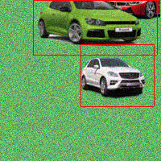
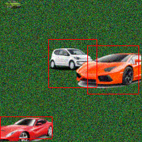
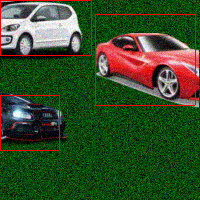
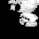
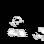
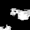
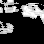

# Moving sprites object detection
Contains a simple model that detects objects in images. The model works on 
[github.com/JakubPetriska/moving-sprites-dataset](https://github.com/JakubPetriska/moving-sprites-dataset) dataset.

Model consists of convolutional neural network (CNN) that predicts whether
pixels of input image contain the object to be detected. After that k-means
is used to detect individual objects. Number of clusters to be detected by
k-means is dynamically adjusted.

## Training
To train the CNN run following script:
```bash
python train.py
```

results of CNN training runs can be inspected with tensorboard by calling:
```bash
tensorboard --logdir=models
```

## Detection
To detect objects in images run following script:
```bash
python detect.py \
    models/model_2017.07.13-01\:20\:37/ \
    ../imgs_detected \
    $(ls ../imgs/*)
```
First argument of the script is directory containing CNN model to be used.
Second one is folder into which annotated images will be saved and after that
input images follow.


## Examples
### Original images with detected bounding boxes





### CNN output





### Output of clustering


## Environment
Code in this repo works with Python 3.5.2 and following
dependencies (Conda format):
```
dependencies:
- openssl=1.0.2j=0
- pip=9.0.1=py35_1
- python=3.5.2=0
- readline=6.2=2
- setuptools=27.2.0=py35_0
- sqlite=3.13.0=0
- tk=8.5.18=0
- wheel=0.29.0=py35_0
- xz=5.2.2=1
- zlib=1.2.8=3
- pip:
  - h5py==2.6.0
  - keras==1.2.0
  - numpy==1.13.0
  - pillow==3.4.2
  - protobuf==3.1.0.post1
  - pyaml==16.12.2
  - pydot-ng==1.0.0
  - pyparsing==2.1.10
  - pyyaml==3.12
  - scipy==0.18.1
  - six==1.10.0
  - tensorflow==0.12.1
  - theano==0.8.2
  - tqdm==4.14.0
```

## License

    Copyright 2017 Jakub Petriska

    Licensed under the Apache License, Version 2.0 (the "License");
    you may not use this file except in compliance with the License.
    You may obtain a copy of the License at

       http://www.apache.org/licenses/LICENSE-2.0

    Unless required by applicable law or agreed to in writing, software
    distributed under the License is distributed on an "AS IS" BASIS,
    WITHOUT WARRANTIES OR CONDITIONS OF ANY KIND, either express or implied.
    See the License for the specific language governing permissions and
    limitations under the License.
